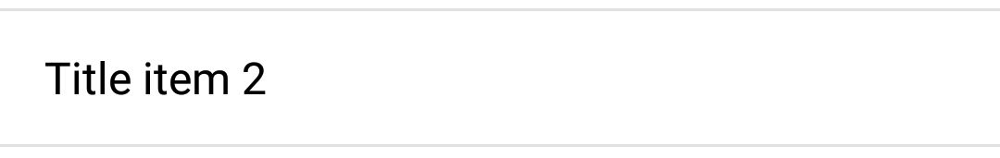
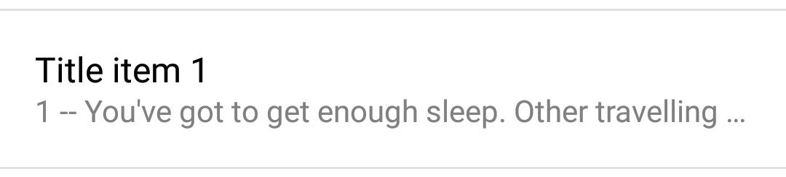
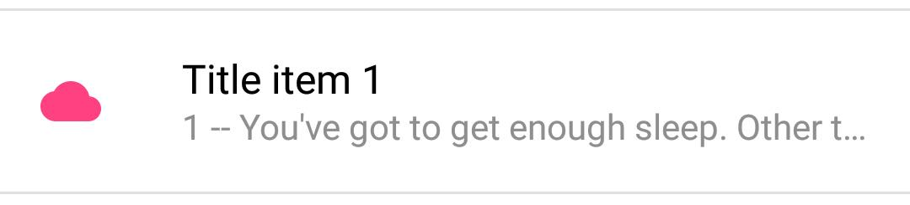
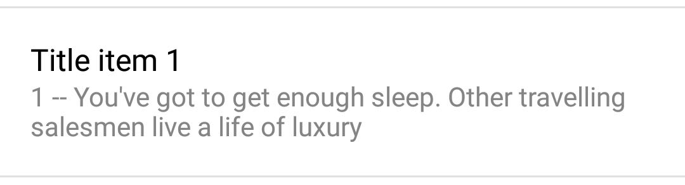
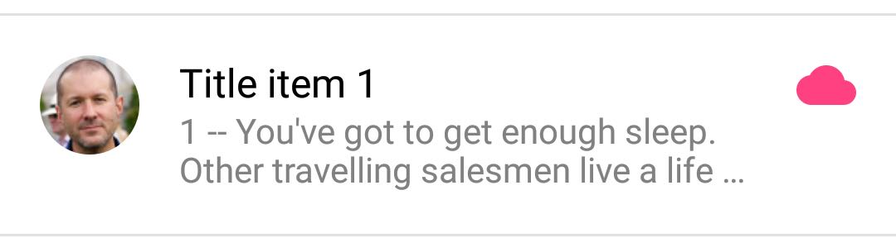
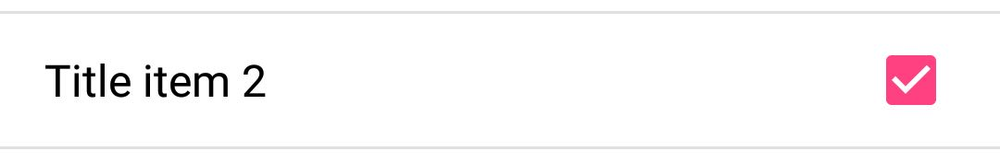
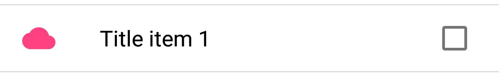

# MaterialListItem

Views which can used in a list based on the [material design spec.](https://www.google.com/design/spec/components/lists.html)

## Usage

Use `getTitleView()`, `getSubtitleView()`, `getIconView()`, `getAvatarView()`, `getCheckboxView()` to get the various views. 

`getAvatarView()` returns a view of type `AvatarImageView` which is a subclass of `ImageView`.
`AvatarImageView` makes sure anything being drawn gets wrapped in an oval mask.

Use within a layout xml:
```xml
<com.asadmshah.materiallistitem.SingleLineAvatarWithTextAndIconView
    xmlns:android="http://schemas.android.com/apk/res/android"
    xmlns:app="http://schemas.android.com/apk/res-auto"
    android:layout_width="match_parent"
    android:layout_height="match_parent"
    app:textColorForTitle="#000"
    app:iconSrc="@drawable/ic_cloud_white_24dp"
    app:iconTint="@color/iconTintColor"
    app:avatarSrc="@drawable/someAvatarImage"
    />
```

The following custom attributes are available when used in a layout xml (depending on the view 
type used):
```xml
    <attr name="textForTitle" format="string" />
    <attr name="textColorForTitle" format="color" />
    <attr name="textForSubtitle" format="string" />
    <attr name="textColorForSubtitle" format="color" />
    <attr name="iconSrc" format="reference" />
    <attr name="iconTint" format="color" />
    <attr name="avatarSrc" format="reference" />
```

## Images

| View Name | Image |
| --------- | ----- |
| SingleLineTextOnlyView |  |
| SingleLineIconWithTextView |  |
| SingleLineAvatarWithTextView |  |
| SingleLineAvatarWithTextAndIconView |  |
| TwoLineTextOnlyView |  |
| TwoLineIconWithTextView |  |
| TwoLineAvatarWithTextView |  |
| TwoLineAvatarWithTextAndIconView |  |
| ThreeLineTextOnlyView |  |
| ThreeLineIconWithTextView |  |
| ThreeLineAvatarWithTextView |  |
| ThreeLineAvatarWithTextAndIconView |  |
| SingleLineCheckboxWithTextView |  |
| SingleLineCheckboxWithIconAndTextView |  |
| SingleLineCheckboxWithAvatarAndTextView |  |

## License
    Copyright 2015 Asad Shah

    Licensed under the Apache License, Version 2.0 (the "License");
    you may not use this file except in compliance with the License.
    You may obtain a copy of the License at

       http://www.apache.org/licenses/LICENSE-2.0

    Unless required by applicable law or agreed to in writing, software
    distributed under the License is distributed on an "AS IS" BASIS,
    WITHOUT WARRANTIES OR CONDITIONS OF ANY KIND, either express or implied.
    See the License for the specific language governing permissions and
    limitations under the License.